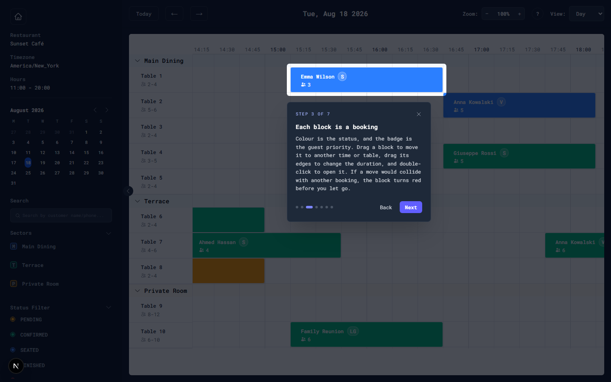

# Reservation Timeline (Woki Challenge)

Hey, happy landing!

To make the experience as smooth as possible, I've prepared a live demo and a welcome page that handles everything for you—no need to clone the repo or run seed scripts just to try it out.

**[➡️ Click here to open the Live Demo](https://woki-challenge.vercel.app/)**

The demo seeds itself: you land on a day that already has bookings, with nothing to press first. A seven-step walkthrough runs on your first visit and explains the grid before you touch it — skippable, and replayable any time from the **?** button in the toolbar.

Thank you for your time, and enjoy!

---

## Showcase

### Key Features Screenshots

| Home Dashboard | Interactive Timeline | AI Scheduling Assistant |
| :---: | :---: | :---: |
|  |  |  |
| *Central hub for data management & stats.* | *Drag, drop, and resize reservations in real-time.* | *Smart suggestions for tables and availability.* |

### Guided walkthrough



*Seven steps that spotlight the real UI — not screenshots — so the explanation and the thing being explained cannot drift apart.*


---


## Guiding Principles

- **Production-Focused:** This is an interactive timeline built with a real-world use case in mind.
- **Honest & Transparent:** This README accurately documents what has been implemented, what is partial, and what is intentionally omitted to set clear expectations.
- **Excellent User Experience:** The project includes a helpful Home page to onboard users, manage demo data, and seamlessly navigate to the core application.

## Key Features

- **Guided Walkthrough:** A first-run tour that explains the grid before you touch it.
- **Interactive Timeline:** Drag-to-create, move, and resize reservations with snapping.
- **Home Dashboard:** A central hub to generate seed data, import/export CSVs, and view calendar stats.
- **Auto-Scheduling Assistant:** Smart suggestions for the best table and next available time slots.
- **Comprehensive Filtering:** Filter by sector, status, and search by customer name/phone.
- **Clean Architecture:** A clear separation of state (Zustand), rendering logic (React), and business rules (services).

---

## Challenge Acceptance Criteria Checklist

This checklist provides a quick, evidence-based summary of how the project meets the challenge requirements.

- ✅ **Timeline Grid:** Implemented (time on X-axis, tables on Y-axis, collapsible sector grouping, sticky headers).
- ✅ **Reservations Display:** Implemented (correct position/size, color-coded status, detailed tooltips).
- ✅ **Create Reservation:** Implemented (drag-to-create on empty space opens a drawer with a live preview).
- ✅ **Move Reservation:** Implemented (snaps to grid, validation occurs on drop).
- ✅ **Resize Reservation:** Implemented (from left/right edges, min duration enforced, validation on drop).
- ✅ **Filtering:** Implemented (sector, status, search) with real-time updates.
- ✅ **Validation:** Implemented (capacity, operating hours, conflicts) via a dedicated service layer.
- ✅ **Guaranteed Data on Arrival:** The timeline resolves its opening date at runtime and always lands on a day that has bookings, regenerating a fresh seed when the persisted one is empty or has fully elapsed. No visitor action required.
- ✅ **Onboarding:** A seven-step guided tour spotlights the real elements and closes by stating what was built and what was deliberately left out. Dismissible, keyboard-driven, replayable.
- ✅ **Conflict Detection:** Implemented on drop *and* live during the gesture — a block that would be rejected turns red and shows a warning badge before you let go.
- ✅ **Accessibility:** The grid exposes `grid`/`row`/`gridcell` roles, reservation blocks are focusable buttons with descriptive labels that open the editor with Enter, sector headers are real buttons reporting `aria-expanded`, and `prefers-reduced-motion` is respected.
- ❌ **Context Menu:** Not Implemented. Actions (edit, duplicate, delete) are available via hover icons for a cleaner UI.
- ❌ **Status Changes:** Not Implemented as a quick menu. Status is changed via the full edit drawer.
- 🟡 **Performance:** The app is performant for moderate data sizes (the demo carries 900 reservations). However, it has not been benchmarked for 200+ reservations *on a single day* and does not use virtual scrolling — `@tanstack/react-virtual` is a dependency but is deliberately not wired up yet.

---

## Bonus Features Implemented

- ✅ **Auto-Scheduling Assistant (COMPLETE)**
  - `AutoSchedulingService.findBestTable` and `findNextAvailableSlots` are fully implemented and integrated.
  - The creation/edit drawer provides **smart table suggestions** to optimize capacity.
  - A **"Find next available"** feature searches for open slots if the desired time is full.
  - Includes experimental **VIP analysis** and smart recommendations.
  - *Note: This is intentionally integrated into the drawer for detailed planning, not the drag-and-drop flow which is designed for quick manual placements.*

- **Not Implemented Bonus Items:**
  - Waitlist Management
  - Mobile-Optimized Experience & Offline Mode
  - Advanced Reporting Suite (Print/Image Export)

- 🟡 **Accessibility (PARTIAL)**
  - Done: grid/row/gridcell roles, focusable reservation blocks with descriptive labels, Enter to edit, sector headers as buttons with `aria-expanded`, visible focus rings, `prefers-reduced-motion`.
  - Not done: arrow-key navigation between slots, and a keyboard equivalent for drag-to-move/resize.

---

## Stack and Choices

- **Framework:** Next.js 15 (App Router) + React 19
- **Language:** TypeScript (strict)
- **State:** Zustand
- **Drag & Drop:** @dnd-kit
- **Dates:** date-fns + date-fns-tz
- **Styling:** Tailwind CSS
- **Tests:** Vitest + Testing Library (unit/integration), Playwright (end-to-end)

### Why a Custom Timeline Component?

The decision to build the timeline from scratch instead of using a library like FullCalendar was a deliberate architectural choice to meet the unique requirements of this challenge:

1. **Resource-Based Axis:** Standard calendar libraries are built for `Date`/`Day` grids. This project required a `Resource` (Table) vs. `Time` grid. A custom build allowed us to create this specific data model without fighting against a library's core assumptions.
2. **Total Control Over UX and Logic:** Building from scratch provided complete control over the highly specific drag-and-drop interactions, deep integration of our custom business validation and auto-scheduling services, and pixel-perfect styling with Tailwind CSS.
3. **Avoiding External Constraints:** This approach avoids the limitations and licensing costs of the few premium libraries that offer a similar "Scheduler" view, demonstrating the ability to deliver a tailored solution without third-party dependencies.

---

## Run Locally

### Development:

```bash
npm install
npm run dev
# Open http://localhost:3000
```

### Build:

```bash
npm run build
npm start
```

### Tests:

```bash
npm run test:all
```

Unit tests only (`npm run test:run`, or `npm run test:ui` for the Vitest UI); end-to-end only (`npm run test:e2e`). The e2e run starts its own dev server on port 3100. First time, install the browser with `npx playwright install chromium`.

---

## App Overview

### Home (`/`): An enhanced landing page for a superior user experience.

- Generates demo data programmatically on first load (dynamic seeds).
- Provides a calendar summary and quick statistics.
- Includes helpers for CSV export/import of demo data.
- Offers one-click navigation to the Timeline.

### Timeline (`/timeline`): The core scheduling UI.

- Time is on the X-axis (configurable start/end hours, 15-min slots).
- Tables are grouped by sector on the Y-axis (with collapsible sectors).
- Reservation blocks are color-coded by status and include a details tooltip.
- Supports drag-to-move and resize, plus drag on empty space to create.

---

## Architecture

### State Store (`src/store/useTimelineStore.ts`)

Zustand store with normalized entities (`reservationsById`, `tablesById`) and UI configuration.

### Timeline Rendering (`src/components/timeline/TimelineLayout.tsx`)

Computes and renders the grid, time header, sector groups, and table rows. Applies all filters.

### DnD Orchestration (`src/app/timeline/page.tsx`)

Sets up @dnd-kit sensors, handles all drag events, and orchestrates validation and state updates.

### Validation & Business Logic:

- `src/lib/reservationValidationService.ts`: Centralizes rules for capacity, duration, hours, and overlap checks.
- `src/lib/autoSchedulingService.ts`: Powers the smart suggestions for best tables and next available slots.
- `src/lib/timelineBootstrapService.ts`: Owns the single definition of *which calendar day a reservation belongs to* (its day in the restaurant timezone), and the rules that pick the day the timeline opens on. The store only holds the resulting date; components only read it.
- `src/lib/dragOrchestrationService.ts`: Pure rules for move, resize-left and resize-right. Takes a gesture and returns `applied` / `invalid` / `rejected` / `noop`. The page translates pointer events and applies the result — it decides nothing, and the same service powers the live conflict warning mid-drag.
- `src/lib/conflictService.ts`: Slot-occupancy map used for fast overlap checks by the scheduling assistant.
- `src/lib/timeUtils.ts`: Manages all conversions between slots, pixels, and ISO time strings.

### UI Components

A modular library including `ReservationBlock`, `TimeHeader`, `TableRow`, `ReservationDrawer`, `Sidebar`, etc.

---

## Core Features in Detail

### Timeline Grid Rendering

- Time header with 15-minute ticks, stronger 30-minute lines, and bold day boundaries.
- Current time indicator (red line).
- Collapsible sector grouping.
- Sticky left column (tables) and sticky top header for easy navigation.
- Native horizontal and vertical scrolling.

### Reservation Blocks

- Position and size are computed from start/end times and the current zoom level.
- Color-coded by status (see `STATUS_COLORS` in `src/lib/constants.ts`).
- Rich content: customer name, party size, priority badge, and a detailed time tooltip on hover.
- Quick actions: edit, duplicate, and delete buttons appear on hover.

### Drag & Drop

- Move reservations horizontally (time) and vertically (between tables).
- Resize from both the left and right edges.
- Drag-to-create on empty space opens the reservation drawer with pre-filled time/table and a live preview.
- All actions snap to 15-minute boundaries.

### Validation & Conflict Detection

- **Capacity:** Party size must fit within the selected table's capacity.
- **Duration:** A minimum duration of 30 minutes is enforced.
- **Operating Hours:** Reservations cannot be created or moved outside of configured hours.
- **Overlap:** Time conflicts on the same table are prevented.

All validation is handled by `ReservationValidationService` before any state is updated. Invalid operations are cancelled and a user-friendly notification is shown.

---

## Known Limitations

- **No Virtual Scrolling:** Performance may degrade with a very large number of tables (e.g., 50+). Left out on purpose: with ten tables it never pays for itself, and shipping it untested would be a claim I could not back with a number.
- **Desktop-First UX:** While functional, touch/mobile gestures are not specifically optimized.
- **No Context Menu:** Actions are handled by hover icons, not a right-click menu, to simplify the UI.
- **Keyboard Creation Is Coarse:** Enter on a table row opens the drawer at the first slot of the day; the exact time is set in the form. Picking a slot with arrow keys is not implemented.
- **Seed Data Is Client-Side:** Data is generated in the browser and persisted to `localStorage`; there is no backend. Clearing site data regenerates a different random restaurant.

### Fixed: the empty grid on first visit

Earlier builds opened the timeline on a hardcoded `2025-10-24` while the seed was always generated relative to *today*, so a first-time visitor saw `0 reservations` in every sector. Two further defects compounded it:

- Reservations were generated in a hardcoded Buenos Aires timezone while the restaurant config picked its timezone at random, so bookings were created in one zone and validated in another.
- The timeline bucketed reservations by their raw **UTC** date while the home calendar used the **restaurant-timezone** date. A 21:00 booking in Buenos Aires is already the next day in UTC, so the two views disagreed and a 90-day seed smeared across 91 partial days.

All three are fixed, and chasing them surfaced three more, each now covered by a regression test:

- **`isoToSlotIndex` was off by a full day in negative-offset timezones.** It measured the day offset from `config.date` parsed as UTC midnight, which in Buenos Aires resolves to 21:00 the *previous* day. A 23:00 booking got slot 188 instead of 92 — past its own end slot — so it silently occupied nothing in the 3-day and week views.
- **The per-table index was ordered by time-of-day, read off the machine clock**, and an unparseable date compared as `NaN`, defeating every comparison. It now orders by instant.
- **`reservationsByTable` was never persisted.** A derived index excluded from `partialize`, it came back empty after any reload. It is now rebuilt on rehydration.

---

## Testing

### Location

Unit and integration tests are co-located with their respective modules (e.g., `src/components/timeline/__tests__/`).

### Coverage Highlights

**Unit / integration (Vitest).** The rendering pipeline, filtering, and the business logic in `autoSchedulingService`, `reservationValidationService`, `conflictService`, `timelineBootstrapService` (day-bucketing and landing-date resolution across all eight generator timezones) and `dragOrchestrationService` (move, resize, conflict, capacity and boundary rules).

**End-to-end (Playwright).** What jsdom cannot reach: the three bootstrap paths (fresh visitor, stale visible date, fully elapsed seed), real pointer drags through dnd-kit, the guided tour, the empty state, filters, keyboard operation, reduced motion, and that robots/sitemap/OG image are actually served.

The e2e run binds to port **3100**, not 3000 — reusing whatever already listens on the default port silently runs the suite against a different project.

Current status: **193 unit tests passing, 17 e2e passing, 0 failing, 0 skipped.**

Two earlier suites (`DragDropOperations`, `ReservationCreation`) were deleted rather than repaired: they asserted a design that was never built — clicking a slot creating a `CONFIRMED` reservation outright, and `TimelineLayout` performing drag updates it never owned. Their coverage now lives in the `dragOrchestrationService` unit tests and the Playwright specs.

### How to run:

```bash
npm run test:all
```

| Command | What it runs |
| :--- | :--- |
| `npm run test:run` | Vitest, once |
| `npm run test:ui` | Vitest with the interactive UI |
| `npm run test:e2e` | Playwright (boots its own dev server) |
| `npm run test:all` | Both suites |

---

## Future Improvements (Prioritized)

1. **Performance:** Implement virtual scrolling for both rows and columns to support hundreds of tables smoothly.
2. **UX:** Add live conflict highlighting during drag operations for immediate visual feedback.
3. **Efficiency:** Introduce a right-click context menu with quick status changes and keyboard shortcuts.
4. **Accessibility:** Implement full keyboard navigation, ARIA roles, and screen reader support.
5. **Mobile:** Develop a dedicated mobile layout with optimized touch gestures.

---

## Credits

Thank you for the clear and thoughtful challenge specification. I had a lot of fun building this project and was inspired to add extra features to demonstrate a complete, user-centric solution.
